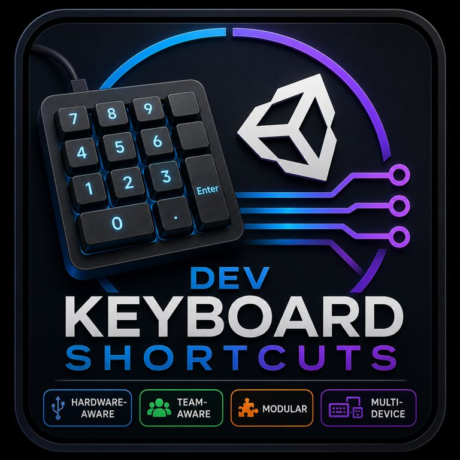

### **Grammar & Clarity Correction**



# DevKeyboardShortcuts System

A hardware-aware Windows Raw Input routing engine for Unity Editor and Standalone builds. It allows developers to bind keyboard shortcuts to modular tools across multiple physical devices without interfering with standard Unity controls or causing Git merge conflicts in team environments.

---

## Core System Features

- **Hardware-Aware:** Distinguishes input from specific physical USB devices using permanent hardware identifiers (`VID_xxxx&PID_xxxx`). You can bind commands exclusively to an auxiliary external numpad while leaving your primary keyboard untouched.
- **Team-Aware & Git-Friendly:** Designed for collaborative workflows using an explicit asset override system. Developers can drag shared team input maps into local, git-ignored override files to customize bindings without generating version control conflicts.
- **Modular Architecture:** Built around self-contained ScriptableObject actions inheriting from `DevActionTool`. Easily create, swap, and configure independent developer tools like Blender-style camera navigation, logarithmic time scaling, scene loading sequences, and play state controls.
- **Multi-Device Support:** Simultaneously connect and route multiple physical keypads, macro pads, or foot pedals. Each device operates independently with its own dedicated modifier keys and double-click sensitivity settings.

---

## Project Directory Structure

```text
dev-keyboard-shortcuts/
├── DataAndSettings/
│   └── DevInputMap/
│       └── Resources/
│           └── DevTools/          # Configured ScriptableObject tool assets
│               ├── BlenderNav/    # Blender-inspired camera navigation tools
│               ├── PlayStateTool/ # Editor play, pause, and step state tools
│               ├── SceneSeqTool/  # Scene sequence loading and iteration tools
│               └── TimeScaleTool/ # Game speed and time scaling tools
├── Documentation/                 # Project documentation
├── Editor/
│   └── DevActionTools/            # Editor-only tool implementations and UI overlays
└── Runtime/
    ├── Core/                      # Win32 Raw Input routing, watchdog, and input maps
    └── DevActionTools/            # Runtime tool base classes (DevActionTool) and scripts

```

---

## Quick Start Guide

### 1. Create a Tool Asset

* Navigate to `DataAndSettings/DevInputMap/Resources/DevTools/`.
* Right-click: **Create → GameLib → Debug → DevKeyboardShortcuts → DevTools → [Select Tool Type]** (e.g., `Time Scale Tool`, `Play State Tool`).
* Configure your specific tool parameters in the Unity Inspector.

### 2. Configure Your Input Map

* Locate or create your active `DevInputMap` asset inside a `Resources` folder.
* Check the **Print Raw Input To Console** checkbox.
* Press any key on your target physical device (e.g., your USB numpad).
* Copy the unique hardware identifier string from the Unity Console log:
`[DevTools Raw Input] VK Code: 97 (Hex: 0x61) | Device Name: 'USB Keyboard (VID_046D&PID_C31C)'`
* Add a new binding entry to the **Bindings** list:
* **Device Hardware Id:** Paste your copied `VID_xxxx` substring (leave empty to match universal keyboards).
* **Virtual Key Code:** Enter the decimal VK code (e.g., `97` for Numpad 1).
* **Modifiers (Optional):** Define up to 2 required holding modifier keys (e.g., Left Ctrl `162`).
* **Require Double Click:** Check this box if the tool should only execute on rapid double-presses.
* **Bound Tool:** Drag and drop your configured `DevActionTool` asset from the project window.


---

## Team Workflows & Local Overrides

To modify or add personal shortcuts without altering the shared team configuration:

* Create a personal input map asset in your project (e.g., `DevInput-MyKeypad.asset`).
* In the Unity Inspector for your personal asset, drag the team's shared base asset into the **Override For** field.
* When Unity initializes, the system will detect the link, suppress the base map from memory, and execute your local customizations alongside other active modules.

### Recommended `.gitignore` Setup

Add the following rules to your project's root `.gitignore` file to ensure local overrides and personal macro pad configurations remain out of version control:

```text
# Ignore local developer keyboard shortcut overrides & macro pad extensions
/[Aa]ssets/**/Resources/*-override.asset*
/[Aa]ssets/**/Resources/*-macropad.asset*
/[Aa]ssets/**/Resources/*-mini6.asset*

```
